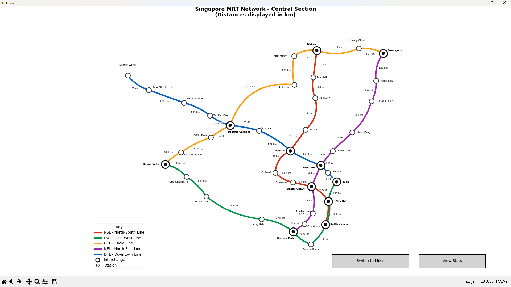

# Singapore MRT Network Visualisation

> **COMP1844 – Information Analysis and Visualisation**  
> Coursework - University of Greenwich  
> Module Leader: Konstantin Kapinchev
> Unit Assessor: Le Tran Ngoc Tran

---

## Overview

An interactive Python application that models the **central section of the Singapore MRT network** as a weighted graph using NetworkX, and visualises it using Matplotlib. The program fulfils both **Task 1** (network map) and **Task 2** (statistical analysis) of the COMP1844 Coursework 2 specification.



---

## Features

- **Geographic map** of 5 MRT lines plotted at accurate GPS coordinates
- **Distance labels** on every track segment (km or miles)
- **Live unit toggle** — switch between km and miles at any time
- **Statistics bar chart** — total track length per line with summary
- **Interactive buttons** — toggle between map view and stats view
- **Interchange detection** — automatically identified and marked with double-ring symbols
- **Haversine formula** — real-world geodesic distances using NumPy

---

## Network Coverage

### Lines (5 total)

| Line             | Code| Colour       | Stations | Length |
|------------------|-----|--------------|---------|--------|
| North-South Line | NSL | red `#D42E12` | 10      | 9.32 km |
| East-West Line   | EWL | green `#009645` | 9       | 10.10 km |
| Circle Line      | CCL | orange `#FA9E0D` | 9       | 11.54 km |
| North East Line  | NEL | purple `#9B26AF` | 10      | 8.88 km |
| Downtown Line    | DTL | blue `#005EC4` | 10      | 10.10 km |

### Network Statistics

| Metric | km | miles |
|---|---|---|
| **Total network length** | **49.94 km** | **31.04 mi** |
| Average length per line | 9.99 km | 6.21 mi |
| Average distance per station pair | 1.16 km | 0.72 mi |

### Interchange Stations (11)

| Station | Lines |
|---|---|
| Bishan | NSL + CCL |
| Botanic Gardens | CCL + DTL |
| Bugis | EWL + DTL |
| Buona Vista | EWL + CCL |
| City Hall | NSL + EWL |
| Dhoby Ghaut | NSL + NEL |
| Little India | NEL + DTL |
| Newton | NSL + DTL |
| Outram Park | EWL + NEL |
| Raffles Place | NSL + EWL |
| Serangoon | CCL + NEL |

---

## Requirements

### Python Version
```
Python
```

### Libraries
This project uses **only the four libraries** specified in the coursework:

```
numpy
pandas
networkx
matplotlib
```

Install all dependencies:
```bash
pip install numpy pandas networkx matplotlib
```

> **Note:** `math` is **not** imported — all mathematical operations (sin, cos, sqrt, radians) use NumPy equivalents as required by the specification.

---

## How to Run

### Step 1 — Clone the repository
```bash
git https://github.com/GNUHHO/COMP1844-CW2-Information-Analysis-and-Visualisation-Ho-The-Hung-GCC230015.git
cd COMP1844-CW2-Information-Analysis-and-Visualisation-Ho-The-Hung-GCC230015
```

### Step 2 — Install dependencies
```bash
pip install numpy pandas networkx matplotlib
```

### Step 3 — Run the program
```bash
python coursework1844-Singapore MRT.py
```

### Step 4 — Choose your unit
The program will prompt you in the console:
```
Singapore MRT Network Visualisation
Which unit do you want to display distances in?
1: Kilometres (km)
2: Miles (mi)
Enter 1 or 2:
```
Type `1` for km or `2` for miles, then press **Enter**.

---

## Interactive Controls

Once the map window opens, two buttons are available at the bottom:

| Button | Action |
|---|---|
| **Switch to Miles** / **Switch to KM** | Toggle all distance labels, map title, and bar chart between km and miles instantly |
| **View Stats** / **Back to Map** | Switch between the network map and the Task 2 statistics bar chart |

---

## File Structure

```
COMP1844-CW2/
│
├── coursework.py          # Main Python source file (Task 1 + Task 2)
├── COMP1844_CW2.pdf      # Report (images + statistics)
├── readme_preview_map.png # Preview Map
└── README.md             # This file
```
## istance Calculation — Haversine Formula

Distances are calculated using the **Haversine formula**, which computes the great-circle distance between two geographic coordinates on the Earth's surface:

```
a = sin²(Δlat/2) + cos(lat₁) · cos(lat₂) · sin²(Δlon/2)
distance = 2 × R × arcsin(√a)    where R = 6,371 km
```

Implemented using NumPy:

```python
def get_distance(lon1, lat1, lon2, lat2):
    R = 6371
    lat1, lat2, lon1, lon2 = np.radians([lat1, lat2, lon1, lon2])
    dlat = lat2 - lat1
    dlon = lon2 - lon1
    a = np.sin(dlat/2)**2 + np.cos(lat1) * np.cos(lat2) * np.sin(dlon/2)**2
    c = 2 * np.arcsin(np.sqrt(a))
    distance_km = round(float(R * c), 2)
    return distance_km, round(distance_km * 0.621371, 2)
```

---

## Data Sources

| Data | Source |
|---|---|
| Station selection & layout | Wikipedia (2020). Mass Rapid Transit (Singapore). [online] Wikipedia. Available at: https://en.wikipedia.org/wiki/Mass_Rapid_Transit_(Singapore)  |
| Station GPS coordinates | www.kaggle.com. (n.d.). Singapore MRT & LRT Stations with Coordinates. [online] Available at: https://www.kaggle.com/datasets/shengjunlim/singapore-mrt-lrt-stations-with-coordinates |
| Official line colours | Land Transport Authority (2019). LTA | Getting Around | Public Transport | Rail Network. [online] Lta.gov.sg. Available at: https://www.lta.gov.sg/content/ltagov/en/getting_around/public_transport/rail_network.html |

---

## References

Networkx.org. (2025). NetworkX — NetworkX documentation. [online] Available at: https://networkx.org/en/.

matplotlib.org. (n.d.). Tutorials — Matplotlib 3.6.0 documentation. [online] Available at: https://matplotlib.org/stable/tutorials/index.html.

Land Transport Authority (2019). LTA | Getting Around | Public Transport | Rail Network. [online] Lta.gov.sg. Available at: https://www.lta.gov.sg/content/ltagov/en/getting_around/public_transport/rail_network.html.

McKinney, W. (2010). Data Structures for Statistical Computing in Python. Proceedings of the 9th Python in Science Conference, 445. doi:https://doi.org/10.25080/majora-92bf1922-00a.

www.kaggle.com. (n.d.). Singapore MRT & LRT Stations with Coordinates. [online] Available at: https://www.kaggle.com/datasets/shengjunlim/singapore-mrt-lrt-stations-with-coordinates.

Gazzano, M. (2023). The Haversine Formula: A Must-Have for Geospatial Reporting. [online] Medium. Available at: https://medium.com/@mattgazzano/the-haversine-formula-a-must-have-for-geospatial-reporting-1a1258552a5e.

Wikipedia (2020). Mass Rapid Transit (Singapore). [online] Wikipedia. Available at: https://en.wikipedia.org/wiki/Mass_Rapid_Transit_(Singapore) 

---
